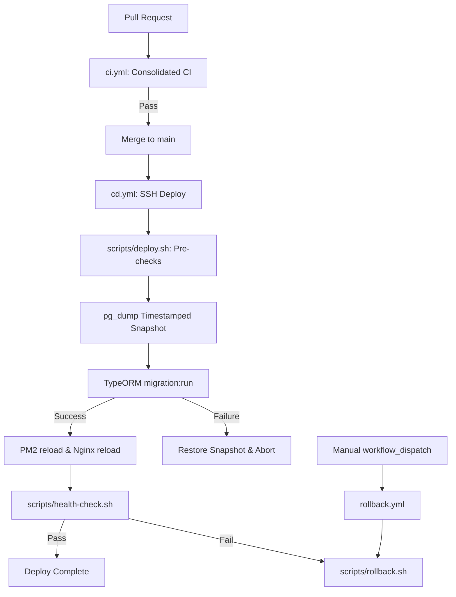

# Design: CI/CD Pipeline with Self-Hosted Runner

## Technical Approach
Implement an automated, deterministic CI/CD pipeline using GitHub Actions on a self-hosted runner targeting bare-metal Proxmox LXC 112 (PM2, Nginx, PostgreSQL). The pipeline consolidates monorepo validation in CI to prevent runner queue starvation, executes CD via secure SSH with automated pre-migration `pg_dump` backups, reloads PM2 with zero downtime, and verifies post-deploy health with automated error traps and manual rollback workflows.

## Architecture Decisions

| Decision Area | Options Considered | Selected & Rationale |
|---|---|---|
| **CI Execution Model** | Granular matrix jobs vs Consolidated single job | **Consolidated single job**: A single self-hosted runner queue would starve under 7 matrix jobs repeating checkout and `pnpm install`. A unified job runs checkout/install once, validating lint, types, tests, and build sequentially with fail-fast semantics. |
| **CD Execution Mechanism** | Runner artifact compile + rsync vs Target shell execution via SSH | **Target shell execution via SSH**: Workflows invoke versioned scripts in `scripts/` directly on LXC 112. Eliminates network artifact sync overhead, ensures identical execution for automated CD and manual emergency operations. |
| **Migration Safety** | NestJS auto-run on boot vs Pre-migration CLI snapshot + trap | **Pre-migration CLI snapshot + trap**: `scripts/deploy.sh` verifies pending migrations, takes a timestamped `pg_dump`, and executes CLI `migration:run`. On failure, it immediately restores DB snapshot before PM2 restart. |
| **Process Management** | `pm2 restart` vs `pm2 reload` | **`pm2 reload`**: Performs zero-downtime rolling reload of worker processes, keeping service available while Nginx routes traffic. |

## Workflow & Data Flow

## File Changes

| File | Action | Description |
|---|---|---|
| `.github/workflows/ci.yml` | Create | Consolidated PR/push CI: checkout, pnpm install, backend `lint:check`, monorepo typecheck, unit tests, builds. |
| `.github/workflows/cd.yml` | Create | CD on `main` push: concurrency lock, SSH setup, invokes `scripts/deploy.sh`, runs health check, cleans SSH keys. |
| `.github/workflows/rollback.yml` | Create | Manual rollback: validates target commit ref, invokes `scripts/rollback.sh`, verifies health check. |
| `scripts/deploy.sh` | Create | LXC deploy runner: git pull, pre-migration `pg_dump`, `pnpm install`, build, `migration:run`, `pm2 reload`, health check. |
| `scripts/rollback.sh` | Create | Rollback executor: checks out target ref, rebuilds, reloads PM2/Nginx, runs health checks. |
| `scripts/health-check.sh` | Create | Verifies HTTP status on backend `/health` (or `/api`) and frontend with retries and exponential backoff. |
| `apps/backend/package.json` | Modify | Add `"lint:check": "eslint \"{src,apps,libs,test}/**/*.ts\""` (non-mutating). |
| `package.json` | Modify | Add root scripts: `"lint"`, `"lint:check"`, `"typecheck"`. |

## Script & Workflow Contracts

- **SSH Orchestration**: Runner connects using temporary private key `~/.ssh/deploy_key` (permissions `600`), cleared in `always()` trap. Target host authenticated via `known_hosts`.
- **Environment & Secrets**: CD/Rollback consume GitHub Secrets (`DEPLOY_HOST`, `DEPLOY_USER`, `DEPLOY_SSH_KEY`) and Variable (`APP_PATH`).
- **Health Check Contract**: `scripts/health-check.sh` exits `0` on HTTP 200 within 5 retries (interval 3s), exits `1` otherwise.
- **Rollback Contract**: `scripts/rollback.sh <commit-hash>` requires a valid git ref (`git cat-file -e`).

## Testing & Validation Strategy

| Layer | Target | Validation Method |
|---|---|---|
| **CI Monorepo** | Lint, Types, Tests, Build | Trigger PR with intentional syntax and type errors to confirm pipeline rejection. |
| **CD Pipeline** | End-to-end deploy | Merge clean PR to `main` on self-hosted runner; verify zero HTTP 502/downtime. |
| **DB Rollback** | Faulty migration trap | Inject failing SQL migration script; verify automated DB restoration from `pg_dump`. |
| **Manual Rollback** | Dispatch workflow | Trigger `rollback.yml` targeting prior commit SHA; verify system stability and health. |

## Threat Matrix / Security & Shell Safety

| Threat / Risk | Level | Mitigation |
|---|---|---|
| **Command Injection in Rollback** | High | Sanitize input commit ref via regex `^[a-zA-Z0-9._-]+$` and `git cat-file -e "$COMMIT"` before execution. |
| **SSH Key Exfiltration** | High | Keys stored in GitHub Secrets; written with mode `600` on runner and removed in `always()` cleanup step. |
| **Silent Script Failures** | Medium | All bash scripts enforce `set -euo pipefail` and custom `die()` traps. |
| **Unauthorized Deploy Trigger** | Medium | CD and Rollback restricted to `environment: production` and branch `main`. |
| **Data Loss on Bad Migration** | High | Pre-migration snapshot saved to `$BACKUP_DIR` before running TypeORM migrations. |

## Rollout Plan
1. Update `package.json` and `apps/backend/package.json` with `lint:check` and typecheck scripts.
2. Commit `scripts/deploy.sh`, `scripts/rollback.sh`, and `scripts/health-check.sh` (`chmod +x`).
3. Commit workflow YAMLs in `.github/workflows/`.
4. Configure GitHub repository secrets (`DEPLOY_HOST`, `DEPLOY_USER`, `DEPLOY_SSH_KEY`, `APP_PATH`) and production environment.
5. Perform dry-run deploy and manual rollback test.

## Open Questions
- None. Required environment variables and host directories align with existing `DEPLOYMENT.md`.
